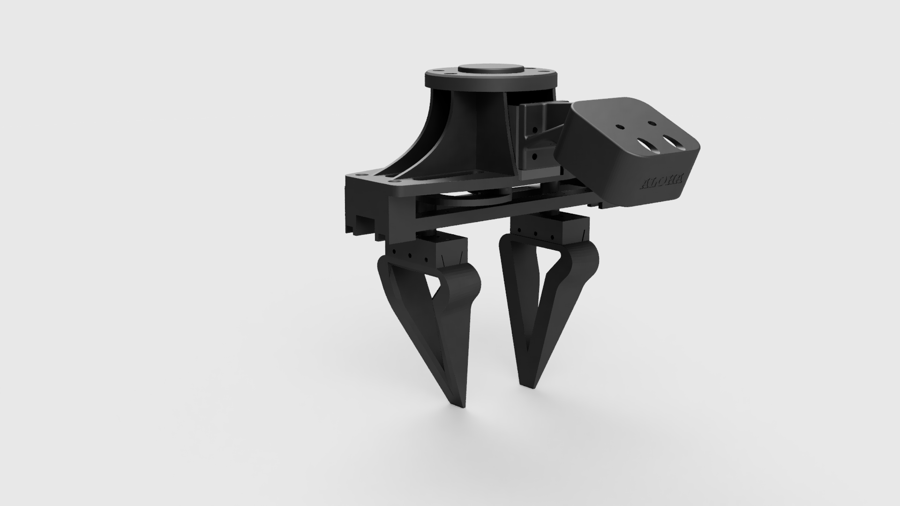

# Aloha4Franka

This repository contains:
- An assembly guide as well as URDF files for an aloha gripper modification that allows it to be mounted on a franka emika robot and any robot with ...
- A simple control setup to test the gripper in ROS2

| Quantity | Part | Link for Germany | Price |
| --- | --- | --- | --- |
| 2 | Linear rails | [RS Online](https://de.rs-online.com/web/p/linearfuhrungsschiene/1766658) ||
| 2 | Linear rail carriage | [RS Online](https://de.rs-online.com/web/p/linearfuhrungsblocke/1766655?searchId=f66cdd79-6102-401d-bbf1-d98e68436d04&gb=s) ||
| 6 | Ball Bearing | [Conrad](https://www.conrad.de/de/p/reely-kugellager-radial-edelstahl-innen-durchmesser-3-mm-aussen-durchmesser-6-mm-drehzahl-max-80000-u-min-1359926.html) ||
| 1 | Servomotor Dynamixel XC430-W150-T  | [MyBotShop](https://www.mybotshop.de/DYNAMIXEL-XC430-W150-T) ||
| 2 | M3 Locknut | [Conrad](https://www.conrad.de/de/p/toolcraft-812808-sicherungsmuttern-m3-din-985-stahl-verzinkt-100-st-812808.html?hk=SEM&WT.mc_id=google_pla&utm_source=google&utm_medium=cpc&utm_campaign=DE+-+PMAX+-+Brand+-+All+products&utm_id=21116787988&gad_source=1&gclid=Cj0KCQjw782_BhDjARIsABTv_JANTH5jU4y1pHcT1HjQwnI3sQFuUyB9l2tfVgSDyTW5K7AZeIDC-u4aAqDdEALw_wcB)||
| 1 | U2D2 Controller | [Reichelt](https://www.reichelt.de/de/de/shop/produkt/dynamixel_u2d2-263256?PROVID=2788&gad_source=1&gclid=CjwKCAjwktO_BhBrEiwAV70jXnXg4zTiIdI9f9MVoYfChmQ_a8Ncw8nTg040xoYzePDXbz_71C89ABoClOgQAvD_BwE)||
| 8 | Normal head M2 x 8mm for finger adaptor on linear rails |  |  |
| 2 | Normal head M2 x 10 mm for motor disk |  |  |
| 4 | Flathead head M3 x 12 mm for linear + backplate connection |  |  |
| 4 | Flathead head M2 x 10 mm for linear on rail |  |  |
| 6 | Flathead head M2 x 20 mm for fingers |  |  |
| 4 | Flathead head M2.5 x 12 mm for motor attachment |  |  |
| 2 | Normal head M3 x 20-22 mm for u-shape connection to finger adaptor |  |  |

Tools for assembly
- M2 Tap [Conrad](https://www.conrad.de/de/p/eventus-by-exact-40701-gewindereparaturbohrer-m2-1-st-1224686.html)
- M3 Tap [Conrad](https://www.conrad.de/de/p/exact-05937-einschnittgewindebohrer-7teilig-metrisch-m3-m4-m5-m6-m8-m10-rechtsschneidend-din-3126-hss-1-set-813035.html)
- Adjustable tap wrench [Conrad](https://www.conrad.de/de/p/exact-04971-windeisen-m1-m8-din-1814-816718.html)

