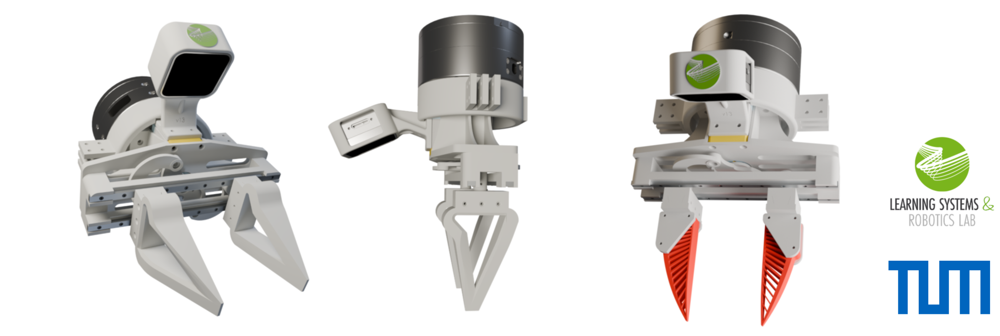

> [!WARNING]
> This repo is heavily under clean-up. Do not expect everything to work.
> Check out https://github.com/danielsanjosepro/dynamixel_wrapper to control the dynamixel motors using python and ROS2 and use it with CRISP.

# Aloha4Franka

*Main contributors - Daniel San José Pro and Marcel Rath*

Check the [docs](https://tum-lsy.github.io/aloha4franka/).
