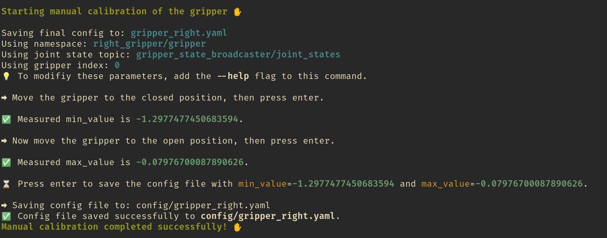

# Getting Started

Ready to control your own robotic gripper? Let's get started.

### Get the code

First, clone the repository:
```bash
git clone https://github.com/TUM-LSY/aloha4franka.git
cd aloha4franka
```

### Create a symlink

Connect your motors, to the power and the USB to your computer - They'll show up as `/dev/ttyACM0` or `/dev/ttyUSB0`.
Find your gripper's serial ID using [cyme](https://github.com/tuna-f1sh/cyme) (or `lsusb`).
Configure the udev rule - Update `scripts/99_gripper.rules` with your serial ID:

```bash
SUBSYSTEM=="tty", ATTRS{serial}=="FT9HDCKD", SYMLINK+="name_for_your_gripper", MODE="0666", ATTR{device/latency_timer}="1"
```

!!! Warning
    If you skip this step, you will have to manually set the mode of the gripper every time you power it off with:
    ```bash
    sudo chmod 666 /dev/ttyUSB0
    ```
    Also, it might be that the device name varies every time you plug it in.
    We highly recommend not skipping this step.

### Build a start the container

```bash
docker compose build
NAMESPACE=your_namespace DEVICE=/dev/name_for_your_gripper docker compose up launch_aloha
```
to start the gripper.

!!! Note "Using a different RMW"
    Multi-machine setup? For distributed systems using [crisp_py](https://github.com/utiasDSL/crisp_py), we recommend CycloneDDS or Zenoh middleware for better performance!
    ```bash
    ROS_NETWORK_INTERFACE=enpXXXX RMW=cyclone NAMESPACE=right DEVICE=/dev/name_for_your_gripper docker compose up launch_aloha
    ```

### Calibrate and Test the gripper with CRISP


Now the gripper is ready to control!
You can get the topic joint values as well as command topics to communicate with the gripper.
If you use [crisp_py](https://github.com/utiasDSL/crisp_py) or [crisp_gym](https://github.com/utiasDSL/crisp_gym) you can use your gripper to it.

First run a calibration:
```bash
python crisp_py/scripts/gripper_manual_calibration.py --help
```

The script will guide you in the calibration procedure:



After running a succesful calibration, you can instantiate a gripper object to control it:

```python
import time
from crisp_py.gripper.gripper import Gripper

gripper = Gripper.from_yaml("your_gripper_config.yaml")
gripper.wait_until_ready()

gripper.open()
time.sleep(3.0)

gripper.close()
time.sleep(3.0)

gripper.set_target(0.5)
time.sleep(3.0)
```
Enjoy the gripper!
